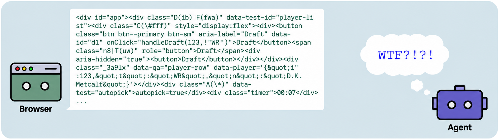
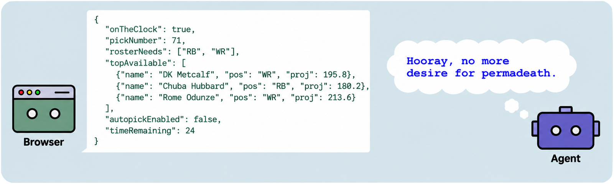
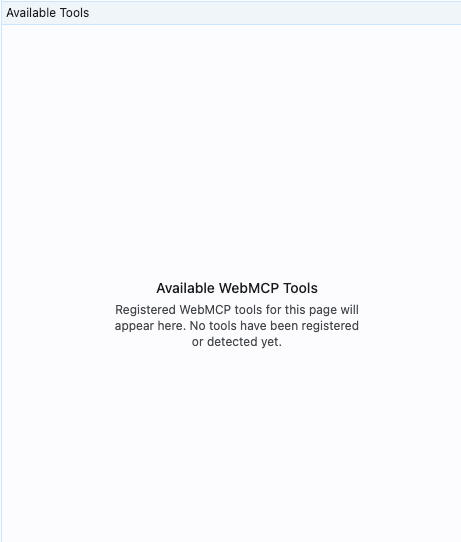
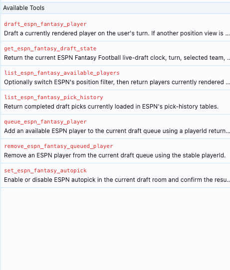
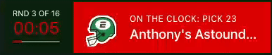
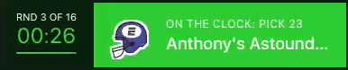

<p align="center">
  <picture>
    <source media="(prefers-color-scheme: dark)" srcset="assets/brand/dominaitrix-hero-dark.png">
    <source media="(prefers-color-scheme: light)" srcset="assets/brand/dominaitrix-hero-light.png">
    
</picture>
</p>

Dominaitrix is a sideloadable Chrome extension that installs curated site adapters. Each adapter adds structured WebMCP tools to a website that does not provide them itself.

Adapters are developed and reviewed in this repository, then distributed through a static, integrity-checked registry. There is no public adapter upload path.

## Example

We ran two ESPN Fantasy Football drafts with the same prompt:

> Draft my fantasy team. I usually wait to get my QB. My bench should be entirely RB and WR. I want my second-to-last pick to be a K and my last to be a D/ST. I have a lower-than-average opinion of Baltimore's offense this year.

| Without Dominaitrix | With Dominaitrix |
| --- | --- |
|  |  |
|  |  |
| **3 of 16** intended players were successfully drafted.<br><br>The rest had issues, timed out, and defaulted to auto-draft. | **16 of 16** intended players were successfully drafted.<br><br>Most were completed with plenty of time to spare. |
|  |  |
| **1 of 5** roster instructions was followed: D/ST was selected last. The roster included an early QB, a backup QB on the bench, an early kicker, and Baltimore's QB. | **5 of 5** roster instructions were followed: QB was delayed until round 9, the bench contained only RBs and WRs, K and D/ST were selected in rounds 15 and 16, and Baltimore's offense was avoided. |
| The LLM's self-retro:<br><br>"In short: 3 picks were directly executed as intended, while the other 13 were lost primarily because ESPN autopick remained active despite attempts to disable it, compounded by browser-control selector mismatches and timing delays. The final roster only partially reflects your strategy." | The LLM's self-retro:<br><br>"In short: all 16 picks were directly executed as intended, with 0 lost, because WebMCP tools bypassed fragile browser-control selectors and timing delays entirely while autopick remained safely disabled throughout. The final roster fully reflects your strategy." |

## Build the extension

1. Run `pnpm install` and `pnpm build`.
2. Open `chrome://extensions` in Chrome.
3. Enable **Developer mode**.
4. Choose **Load unpacked** and select the `extension` directory.
5. Approve site access when Chrome asks.
6. Open the extension's details and enable **Allow User Scripts**.

The extension checks the hosted registry on installation, browser startup, and every six hours while automatic updates are enabled. Unchanged checks use ETag revalidation, and the registry URL can be changed in the extension settings.

## Request a website

[Open an adapter request](../../issues/new?template=adapter-request.yml) with:

- the website and the narrowest useful starting URL;
- why WebMCP support would be useful there;
- the information or actions you want exposed as tools; and
- whether those actions require an account, subscription, or time-sensitive workflow.

Do not include credentials, cookies, access tokens, or private page content. Pull requests for adapters are also welcome.

## Develop an adapter

Use `.agents/skills/create-dominaitrix-adapter` or copy `adapters/_template`. Every non-underscore directory inside `adapters/` is included in the generated registry; keep unfinished work in an underscore-prefixed directory.

```sh
pnpm registry:build
pnpm check
```

The generated `registry/` directory is deployment output and is intentionally ignored by Git. Adapter source and metadata remain under `adapters/` for review.

## Security and privacy

Adapters execute publisher-reviewed code on their declared websites. The client verifies each downloaded source file against the SHA-256 digest in the registry, but the registry and adapter files share the same publisher trust boundary.

Adapter health events stay in the browser and can be exported from the popup. Dominaitrix does not upload diagnostics, tool arguments, page contents, response bodies, or authentication data.

See `docs/architecture.md`, `docs/registry.md`, and `docs/telemetry.md` for the technical contracts.
